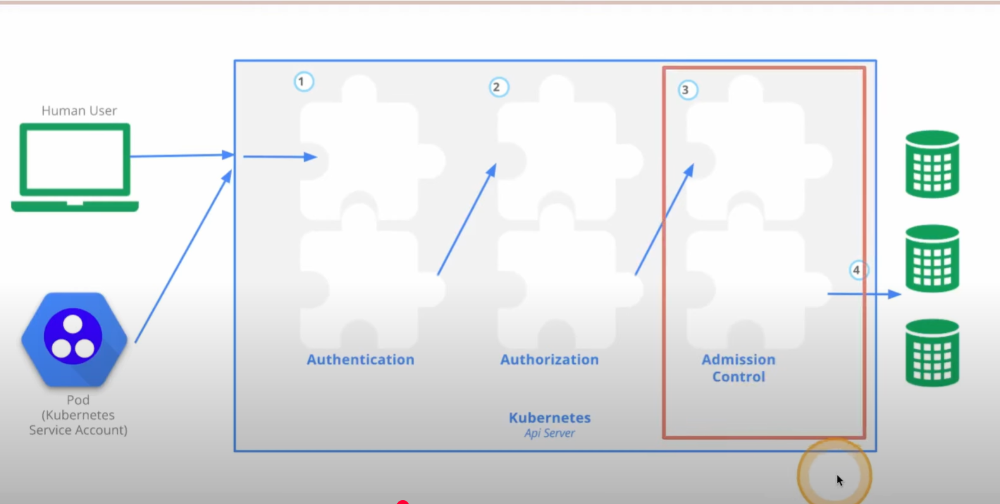

#
auth by sa

1. autorization: who are you
2. authentethication: are you allow to
3. run: is tech limit reached

nano /etc/kubernetes/manifests/kube-apiserver.yaml
- --anonymous-auth=false

- Kube api will answering:
- 401 
- vs 403

kubectl allow to setup
kube-api-server
--insecure-port=8080
--insecure-port=0

 curl https://127.0.0.1:6445 -k
or
config view --raw
echo XXX |base64 -d > key
echo YYY |base64 -d > crt
echo ZZZ |base64 -d > ca

---> Valid (no -k) request
 curl https://127.0.0.1:6445 --cacert ca --cert crt --key key
{
  "kind": "Status",
  "apiVersion": "v1",
  "metadata": {},
  "status": "Failure",
  "message": "Unauthorized",
  "reason": "Unauthorized",
  "code": 401

##
enter request as k8s API
[root@deckhouse-master-node-01 cis]# kubectl get svc
NAME         TYPE        CLUSTER-IP   EXTERNAL-IP   PORT(S)   AGE
kubernetes   ClusterIP   10.222.0.1   <none>        443/TCP   2y32d

## Certificates
.kube/config
/etc/kubernetes/pki

## admission controller
by labels for nodes
node-restriction.kubernetes.io/test=yes

https://kubernetes.io/docs/concepts/security/controlling-access/
